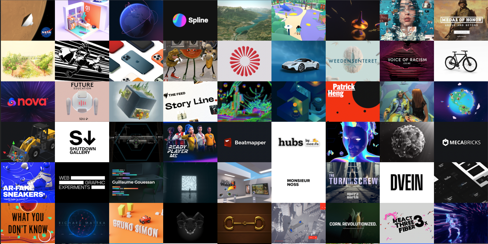

# WebGL 이란?

WebGL은 OpenGL을 기반으로 하는 JavaScript API / Library로 웹 브라우저가 추가 플러그인, 타사 플로그인 또는 브라우저 확장 프로그램을 설치할 필요 없이 브라우저에서 3D / 2D 그래픽을 렌더링을 도와준다. WebGL을 사용하면 브라우저를 통해 GPU를 사용하여 3D 그래픽을 HTML 페이지로 렌더링 할 수 있다.

 

[Three.js](https://threejs.org/)

 

아래 사이트는 다양한 개발 샘플이 있다.

[Three.js](https://threejs.org/)

 

API 관련 사이트

[Viewer API](https://sketchfab.com/developers/viewer/initialization)

 

참고 글
[20 Open Source WebGL Frameworks](https://medevel.com/16-webgl-opensource-frameworks/)

 
 
